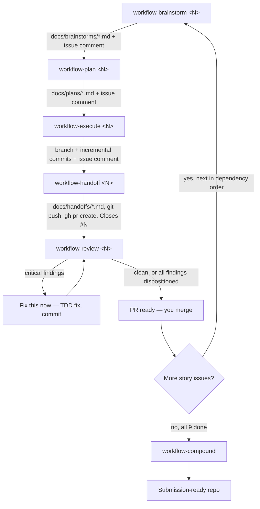

# AIDLC Usage Guide — Event Ledger

How to run the AIDLC (AI-Driven Development Life Cycle) six-skill
workflow — `workflow-brainstorm` → `workflow-plan` → `workflow-execute`
→ `workflow-handoff` → `workflow-review` → `workflow-compound` — against
this repository's GitHub issues, end to end.

## Provenance

These are now **real, installed Claude Code skills** under
`.claude/skills/workflow-*/`, not a description of commands that live
somewhere else. They're adapted from a larger reference workflow built
for a multi-repo hub with a richer external work-item tracker. Three
deliberate differences from that reference, since EventLedger doesn't
share its constraints:

1. **GitHub Issues, not an external work-item tracker.** Every work-item resolve/comment/assign/start operation in the reference is replaced with a direct `gh issue` call. GitHub issues are only ever `OPEN`/`CLOSED` — there's no multi-stage state ladder to mirror, and none is added here.
2. **No multi-repo docs routing.** The reference routes docs to a per-subrepo path or a shared hub path depending on which of several repos a change touches. EventLedger is one repo — docs always live under `docs/`, so that whole routing step is dropped.
3. **`workflow-handoff` pushes the branch and opens a GitHub PR.** In the reference, Handoff only writes the artifact (Release Notes / Risk Analysis / Test Coverage); PR creation is a separate tool tied to the external tracker. EventLedger has no equivalent separate tool, so PR creation was folded into Handoff — this is the one place this repo's behavior is a genuine addition beyond the reference, not just a trim.

Every other mechanic below — the plan checkbox format, the TDD execute loop, the review artifact's disposition tracking, the compound solution/pattern split — is a direct, verified port of the reference skill's actual behavior, not a guess.

## Quick reference

| Phase | Skill | Input | Writes to | GitHub action |
|---|---|---|---|---|
| Brainstorm | `workflow-brainstorm` | Issue number or free-text topic | `docs/brainstorms/<issue-id>_<slug>-brainstorm.md` | Comment on the issue |
| Plan | `workflow-plan` | Issue number or free-text topic | `docs/plans/<issue-id>_<name>-plan.md` | Comment on the issue |
| Execute | `workflow-execute` | Issue number or plan file path | Source code + tests, on an `<issue-id>_<slug>` branch | Branch created, incremental commits, comment on the issue |
| Handoff | `workflow-handoff` | Issue number | `docs/handoffs/YYYY-MM-DD-HHMMSS-<branch>-handoff.md` | `git push` + `gh pr create`, `Closes #<id>` |
| Review | `workflow-review` | Issue number or `continue` | `docs/reviews/<branch-slug>.json` (= `<issue-id>_<slug>.json`) | Fix-up commits on the same branch/PR |
| Compound | `workflow-compound` | `context` or nothing | `docs/solutions/<category>/`, `docs/patterns/` | Comment on the issue (if resolvable) |

All six take a **GitHub issue number** as their primary argument, exactly as you specified. Brainstorm/Plan/Execute/Review all anchor their filenames and branch name to that issue number (`<issue-id>_<slug>`) rather than a date — a plan and its brainstorm now sort together and share one identifier with the branch that implements them. Handoff and Compound keep date-based naming (see `docs/CLAUDE.md` for why). `docs/CLAUDE.md` documents the full directory structure these skills write to and how it relates to `architecture/`/`standards/`.

## Overview

Applied per issue, in order: `workflow-brainstorm <N>` → `workflow-plan <N>` → `workflow-execute <N>` → `workflow-handoff <N>` (opens the PR) → `workflow-review <N>` (reviews the PR's diff, fixes findings on the same branch). Repeat for each of the 9 open story issues
([#2](https://github.com/vijaykgubbala/EventLedger/issues/2)–[#10](https://github.com/vijaykgubbala/EventLedger/issues/10)
— [#1](https://github.com/vijaykgubbala/EventLedger/issues/1) is Foundation and already closed). Run `workflow-compound` after a batch of stories (not necessarily every single one — see below), to promote durable lessons into `docs/patterns/`.

**Recommended issue order** (dependency-driven — per each issue's own "Depends on" line):

```
#3 (Service separation) → #2 (Core functionality) → #4 (Tracing)
→ #5 (Observability) → #6 (Resiliency) → #7 (Graceful degradation)
→ #8 (Docker Compose) → #9 (Automated tests) → #10 (README)
```

## Brainstorm phase

`workflow-brainstorm <issue-id>`: resolves the issue via `gh issue view`, researches the codebase (`Explore` agent against `architecture/`, `standards/`, and `src/` once it exists), asks 3–7 clarifying questions one at a time via `AskUserQuestion`, then proposes 2–3 approaches with a clear recommendation. Writes `docs/brainstorms/<issue-id>_<topic-slug>-brainstorm.md` (falls back to a date-based filename only for a free-text topic with no issue) and comments the result back onto the issue.

```
workflow-brainstorm 3
```

(brainstorms Service Separation — issue #3, recommended first per the dependency order above)

**Constraint:** produces documentation only — never touches application code, and never changes the issue's open/closed state (brainstorming isn't "starting work").

## Plan phase

`workflow-plan <issue-id>`: checks `docs/brainstorms/` for a prior brainstorm on this issue and uses its recommendation as input, researches the codebase and `docs/solutions/` for relevant prior lessons, runs the **architecture pre-flight** (invokes the `architecture-guide` skill whenever the plan touches `src/`, and rewrites any step that would violate a returned layer rule before the plan is written), resolves every open risk via `AskUserQuestion` before writing anything, then writes a plan with ordered, checkbox implementation steps and a Testing Strategy section (test cases listed *before* the implementation steps they verify — test-writing steps must precede implementation steps in the checkbox order).

```
workflow-plan 3
```

Writes `docs/plans/<issue-id>_<name>-plan.md`. Never leaves an unresolved risk or open question in the final document.

## Execute phase

`workflow-execute <issue-id>`: loads the plan, creates an `<issue-id>_<slug>` branch (`3_service-separation`, `10_readme`) — same issue-anchored convention as the brainstorm/plan filenames, no `feat`/`fix`/`docs` type prefix — breaks the plan into tracked tasks, runs the architecture pre-flight again immediately before writing code, then executes each task as red‑green‑refactor TDD — failing test first, minimum implementation, refactor with tests green, incremental commit via the `commit` skill, check off the plan item.

```
workflow-execute 3
```

Two things carried over from the reference that are worth calling out because they're easy to skip past: the **`AppMarker.cs` / `public partial class Program`** requirement (needed for `WebApplicationFactory<Program>` in the cross-service integration test — add it before Story 8, not after discovering the test project won't compile), and the **`.claude/settings.json` pollution check** before and after every branch (session-local permission grants get auto-appended during a session; revert them before they pollute a commit diff).

Ends with `/simplify` over the diff (gated by a targeted test re-run before committing anything non-trivial it proposes), then a completion comment on the issue suggesting `workflow-handoff` next.

## Handoff phase

`workflow-handoff <issue-id>`: writes the handoff artifact — Release Notes (plain-language, for an evaluator reading the PR, not a commit-message rehash), Risk Analysis (one row per area touched: blast radius, reviewer focus, mitigation), Test Coverage (planned-vs-actual reconciled against the plan's Testing Strategy, plus a "What's Not Tested" narrative) — to `docs/handoffs/`, **then pushes the branch and opens the PR**:

```
workflow-handoff 3
```

PR body includes the Release Notes, a link to the full handoff file, and `Closes #3`. This is the step that actually ships a story's code to GitHub — per the Constraints in `workflow-handoff/SKILL.md`, it's optional in the reference this is adapted from, but not optional here, since it's the only path to a PR.

**Still open:** whether the PR gets merged by you manually after review, or there's a separate merge step this guide should also cover. Not resolved yet — flagging it rather than guessing, same as the last revision.

## Review phase

`workflow-review <issue-id>` (run against the PR `workflow-handoff` just opened): diffs the branch against `master`, discovers which `review-*` agents are relevant by reading their trigger descriptions, dispatches all five in parallel (`review-correctness`, `review-dotnet`, `review-testing`, `review-security`, `review-maintainability`) using each agent's own `subagent_type` (not `general-purpose`, so its tool restrictions apply), auto-retries once on a bad response, and persists everything to `docs/reviews/<branch-slug>.json` — since the branch is already `<issue-id>_<slug>`, that's the whole filename, no separate timestamp needed. A second review pass on the same branch updates the same file rather than creating a new one, which is what makes `workflow-review continue` able to resume it.

```
workflow-review 3
```

If it comes back clean (zero findings across every agent that ran), it says so and stops — no walkthrough needed. Otherwise, it walks findings one at a time (critical → warning → suggestion) with four options: **Fix this now** (TDD fix, committed, disposition recorded as `addressed`), **Skip — won't fix** (`ignored`, reasoning required), **Defer to later** (`deferred`, reasoning + optional follow-up issue), **Fix all remaining**. Every disposition is written back to the artifact — nothing gets silently resolved. Interrupted a walkthrough? `workflow-review continue` picks up exactly where you left off, from the persisted `pending` findings — it does not re-run the agents.

## Compound phase

`workflow-compound` (no argument = full sweep; `workflow-compound context` = fast, current-conversation-only capture): mines recent commits and, in full mode, does a second pass to catch what the diff alone doesn't show, then writes focused solution files to `docs/solutions/<category>/<slug>-<date>.md` and — only for insights that generalize beyond this one issue — pattern files to `docs/patterns/` (the same directory already seeded with the idempotency-key-race and cancellation-token-propagation lessons from the initial scaffold).

Run this after a batch of stories, not after every single one — e.g. once after Phase 1 (#3, #2) lands, again after Phase 3 (#6, #7), and once more at the end. A pattern worth keeping usually only becomes visible after a couple of stories, not after the first.

## GitHub workflow — the full per-story sequence

1. `workflow-brainstorm <N>` → comments the issue.
2. `workflow-plan <N>` → comments the issue.
3. `workflow-execute <N>` → creates `<N>_<slug>`, commits incrementally, comments the issue when done.
4. `workflow-handoff <N>` → writes the handoff doc, pushes, opens the PR (`Closes #<N>`), comments the issue with the PR link.
5. `workflow-review <N>` → reviews the PR's diff; any fixes land as additional commits on the same branch.
6. You merge the PR (mechanics not yet finalized — see Handoff above). Merging closes issue `#N` via the `Closes #<N>` reference in the PR body.
7. Periodically: `workflow-compound` to promote durable lessons.

Commit trailer convention carried over unchanged from before: every commit ends with `Co-Authored-By: Claude Sonnet 5 <noreply@anthropic.com>` — verified against this repo's actual history.

## Per-story sequence diagram


