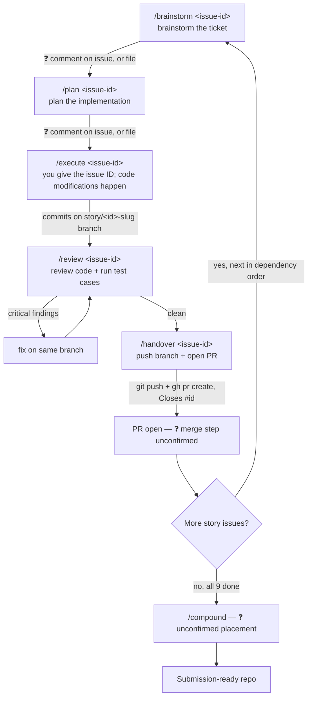

# AIDLC Usage Guide — Event Ledger

How to run the AIDLC (AI-Driven Development Life Cycle) six-command
workflow — `/brainstorm` → `/plan` → `/execute` → `/review` → `/compound`
→ `/handover` — against this repository's GitHub issues, end to end.

## Confidence legend

This revision corrects the first draft, which stated invented CLI flags as
if they were verified fact. To avoid repeating that, every claim below is
tagged:

- **✅ Confirmed** — you stated this directly, or it's verified against
  this repo's actual state (git log, real files, real issue numbers).
- **💡 Recommended** — my proposal for wiring AIDLC into this repo's
  existing `.claude/` tooling. Not something AIDLC does natively as far as
  I know — a suggestion you can take or leave.
- **❓ Assumed** — a gap you haven't specified yet; my best guess, called
  out so it doesn't get mistaken for something you confirmed.

## Quick reference

| Phase | Command | Input | What it does ✅ | GitHub action |
|---|---|---|---|---|
| Brainstorm | `/brainstorm <issue-id>` | An issue ID | Brainstorms approach for that specific ticket | ❓ output location — see [Brainstorm phase](#brainstorm-phase) |
| Plan | `/plan <issue-id>` | An issue ID | Plans the implementation for that ticket | ❓ output location — see [Plan phase](#plan-phase) |
| Execute | `/execute <issue-id>` | An issue ID | Makes the code modifications for that ticket | Commits on a story branch (💡 recommended) |
| Review | `/review <issue-id>` | An issue ID | Reviews the code **and** runs the test cases | 💡 wired to `workflow-review` + `test-dotnet` skills |
| Compound | `/compound` | ❓ unconfirmed | ❓ not covered in your clarification — see [Compound phase](#compound-phase) | ❓ unconfirmed |
| Handover | `/handover <issue-id>` | An issue ID | **Pushes the code to GitHub and creates a PR** | `git push` + `gh pr create`, `Closes #<id>` |

The five confirmed commands all take **an issue ID as their input** — not
a free-text prompt, not a flag-laden invocation. The first draft of this
guide invented flags like `--agents`, `--story`, `--validate-with`; none
of that was real. This version only asserts the issue-ID argument, since
that's what you actually told me.

## Overview

AIDLC is a six-command workflow, applied here **per GitHub issue**: give
`/brainstorm`, `/plan`, `/execute`, `/review`, and `/handover` the same
issue ID in sequence, and that one story moves from idea to an open PR.
Repeat the loop for each of the 9 story issues already open in this repo
([#2](https://github.com/vijaykgubbala/EventLedger/issues/2)–[#10](https://github.com/vijaykgubbala/EventLedger/issues/10)
— [#1](https://github.com/vijaykgubbala/EventLedger/issues/1) is the
Foundation issue and is already closed). `/compound` sits outside that
per-issue loop; where exactly it fits is still unconfirmed — see below.

**Recommended issue order** (dependency-driven, not issue-number order —
per each issue's own "Depends on" line):

```
#3 (Service separation) → #2 (Core functionality) → #4 (Tracing)
→ #5 (Observability) → #6 (Resiliency) → #7 (Graceful degradation)
→ #8 (Docker Compose) → #9 (Automated tests) → #10 (README)
```

## Brainstorm phase

**✅ Confirmed:** `/brainstorm <issue-id>` brainstorms about that specific
ticket — not a free-text design question, not the whole system at once.

**❓ Assumed — where the output goes.** You didn't say whether Brainstorm's
output lands as a comment on the issue, an edit to the issue body, or a
separate file. Two reasonable options, neither confirmed:

- 💡 Post it as a comment on the issue (`gh issue comment <id>`) — keeps
  the ticket itself as the single record of its own design discussion.
- 💡 Write it to a scratch file referenced from the issue — better if the
  brainstorm output is long enough to want its own diff/history.

Until you confirm, default to **issue comment** — it's the lower-ceremony
option and keeps everything about one story in one place.

**Example for this project:**

```
/brainstorm 3
```

(brainstorms Service Separation — issue [#3](https://github.com/vijaykgubbala/EventLedger/issues/3),
recommended first per the dependency order above)

**Sub-agents:** the original spec named `RepoCartographer` and
`DependencyAnalyst` for this phase, to map repo structure and service
dependencies before proposing anything. ❓ How they're invoked (automatically
as part of `/brainstorm`, or separately) is unconfirmed — the first draft
guessed a `--agents` flag with no basis. Treat that detail as open until
you clarify it.

**What's already true for this repo:** issue [#1](https://github.com/vijaykgubbala/EventLedger/issues/1)
retroactively documents the Foundation work (`architecture/`, `standards/`,
etc.) that produced this repo's design decisions — but that work was done
directly in conversation, **not** via an actual `/brainstorm <issue-id>`
run, since issue #1 didn't exist yet when it happened. The first draft of
this guide incorrectly implied `/brainstorm` had already run and produced
`architecture/`. Correction: the content is *equivalent* to what a
Brainstorm phase would produce; the command itself never executed.

## Plan phase

**✅ Confirmed:** `/plan <issue-id>` plans the implementation for that
ticket, following on from its Brainstorm output.

**❓ Assumed — output location**, same open question as Brainstorm: issue
comment (💡 recommended, for the same reason) vs. a separate file. The
first draft invented a root-level `PLAN.md` and a `docs/adr/NNNN-title.md`
convention — neither confirmed; dropped here rather than repeated.

**Example for this project:**

```
/plan 3
```

**What the plan should reference** (💡 recommended content, not a command
behavior I can confirm): the relevant `architecture/*.md` and
`standards/*.md` docs that already own the decisions for that story — e.g.
for issue #3, `standards/backend-architecture.md` and
`standards/service-boundaries.md`. Pointing into those docs rather than
re-deriving the design keeps the plan short and avoids restating a
decision that's already recorded.

## Execute phase

**✅ Confirmed:** you give `/execute <issue-id>`, and it makes the code
modifications for that ticket.

**Example for this project:**

```
/execute 3
```

**💡 Recommended — branch per story:** since Handover (below) pushes and
opens a PR, Execute should commit to a story branch rather than directly
on `master` — a PR needs a non-default branch to diff against. Suggested
naming: `story/<issue-id>-<slug>`, e.g. `story/3-service-separation`.
This wasn't specified in your clarification; flagging it as the one
structural inference required to make Handover's PR step make sense.

**💡 Recommended — commit discipline:** one commit per logical change
within the story is fine; what matters is that the whole story stays on
its own branch and doesn't get mixed with another story's changes.
Message convention: `<type>(<scope>): <summary>`, ending with
`Closes #<issue-id>` and the `Co-Authored-By: Claude Sonnet 5
<noreply@anthropic.com>` trailer — the latter is ✅ confirmed against this
repo's actual commit history; the former is 💡 proposed (only `docs:` has
been used in this repo so far, so the full `{feat, fix, test, docs,
chore}` scheme is aspirational, not yet observed).

## Review phase

**✅ Confirmed:** `/review <issue-id>` reviews the code **and executes the
test cases** — both, not just one.

**💡 Recommended wiring** to this repo's existing tooling:
- Code review → the `workflow-review` skill, which dispatches all five
  `review-*` agents (`review-correctness`, `review-dotnet`,
  `review-testing`, `review-security`, `review-maintainability`) in
  parallel and merges their `critical`/`warning`/`suggestion` findings.
  This severity vocabulary is ✅ confirmed — it's defined verbatim in each
  `.claude/agents/review-*.md` file.
- Running test cases → the `test-dotnet` skill (`dotnet test` with
  coverage collection, flags anything under 80%).

**Example for this project:**

```
/review 3
```

**What to do with findings:** `critical` findings block moving on — fix
them on the same story branch before Handover. `warning` findings: fix
now if small, otherwise note on the issue as a follow-up. `suggestion`
findings are optional.

## Compound phase

**❓ Not covered in your clarification.** Your message specified
Brainstorm, Plan, Execute, Review, and Handover precisely, but didn't
mention Compound. The first draft's description (promote reusable
patterns from `docs/patterns/` to the shared base repo, run once near the
end of the project) is carried forward here as a placeholder, but it's
**unconfirmed** — treat it as the least reliable section of this guide
until you clarify where it fits relative to the per-issue loop (after
every story? once at the end? not used for this project at all?).

## Handover phase

**✅ Confirmed:** `/handover <issue-id>` pushes the code to GitHub and
creates a PR.

**Example for this project:**

```
/handover 3
```

**💡 Recommended mechanics** (the "how," since you confirmed the "what"
but not the exact mechanics):
- `git push -u origin story/3-service-separation`
- `gh pr create --title "Story: Service separation" --body "Closes #3" --base master`

**❓ Assumed — who merges, and when.** You said Handover creates the PR;
you didn't say whether Handover also merges it, or whether merging is a
separate manual step (e.g. you review the PR yourself, or a final
end-of-project pass merges all nine). Left open rather than guessed.

**❓ Assumed — final submission Handover.** It's unclear whether there's
also a *final* Handover pass across the whole project (finalizing
`README.md`'s three `TODO` stubs, confirming the commit history reads as
a narrative) distinct from the per-story `/handover <issue-id>` calls, or
whether the last story's Handover doubles as that. The first draft assumed
a single project-wide Handover step; that's now superseded by the
per-issue Handover you described, but the README-finalization work still
needs to happen somewhere — flagging it so it doesn't fall through the
cracks. Simplest assumption until told otherwise: **fold README
finalization into issue #10's own Execute/Review/Handover cycle**, since
issue #10 already exists specifically for that ("Story 9: README").

## Per-story sequence diagram



This loop replaces the first draft's single-pass
Brainstorm→Plan→Execute→Review→Compound→Handover sequence, which assumed
one project-wide run of each command. What you actually described is a
loop of Brainstorm→Plan→Execute→Review→Handover **per issue**, run nine
times (once for each open story issue), with Compound's position still to
be confirmed.
