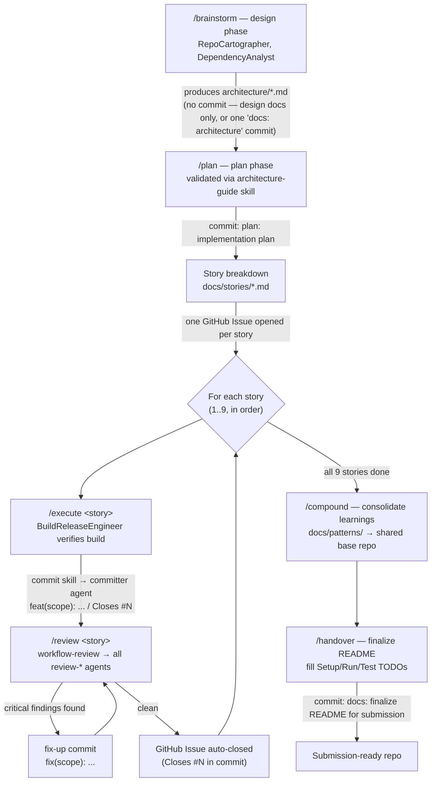

# AIDLC Usage Guide — Event Ledger

How to run the AIDLC (AI-Driven Development Life Cycle) six-command
workflow — `/brainstorm` → `/plan` → `/execute` → `/review` → `/compound`
→ `/handover` — against this repository, end to end, from empty scaffold
to take-home submission.

This guide is project-specific. For the commands' general behavior, flags,
and defaults, see the shared base repository's own documentation — this
document only covers how each phase applies *here*, against Event
Ledger's actual architecture, standards, and Claude Code tooling.

## Quick reference

| Phase | Command | Sub-agents / repo tooling invoked | Primary artifact | GitHub action |
|---|---|---|---|---|
| Design | `/brainstorm` | `RepoCartographer`, `DependencyAnalyst` | [architecture/](architecture/) (already produced — see [Design phase](#design-phase-brainstorm)) | none — pre-commit exploration |
| Plan | `/plan` | `architecture-guide` skill (validates against `architecture/`) | `PLAN.md` | One planning commit |
| Story breakdown | *(manual, no command)* | — | `docs/stories/*.md` + GitHub Issues | One Issue opened per story |
| Execute | `/execute <story>` | `BuildReleaseEngineer`, `commit` skill → `committer` agent | Source code for one story | One commit per story, `Closes #N` |
| Review | `/review <story>` | `workflow-review` skill → all `review-*` agents | Review findings | Fix-up commit, or a follow-up Issue |
| Compound | `/compound` | — | Pattern promoted to the shared base repo | Optional `docs/patterns/` finalization commit |
| Handover | `/handover` | — | Final `README.md` + submission summary | Final commit (and tag, if used) |

This repo already has `.claude/agents/` and `.claude/skills/` (from the
earlier scaffold commit) that AIDLC phases below call into directly —
`architecture-guide`, `commit`, `test-dotnet`, `workflow-review`, and the
five `review-*` agents. AIDLC doesn't replace that tooling; it sequences
when each piece gets used.

## Overview

AIDLC is a six-command Claude Code workflow that lives in the shared base
repository and is available in every project session. It structures work
into six phases — **Brainstorm** (explore the design space),
**Plan** (commit to one design and turn it into an implementation plan),
**Execute** (build one story at a time), **Review** (verify a story
against the plan before moving on), **Compound** (feed durable learnings
back into the shared base repo), and **Handover** (produce the final,
submission-ready artifacts). Applied to Event Ledger, it maps directly
onto the take-home's own lifecycle: design the Gateway/Account Service
split, plan the concrete contracts and schema, break the assignment's nine
requirement categories into stories, implement and review each one with a
clean commit per story, and hand over a finished README and working
system. The sections below walk through that mapping phase by phase.

## Design phase (`/brainstorm`)

**Purpose:** explore architecture options before anything is written down
as a decision — topology, idempotency strategy, persistence choice,
resiliency pattern — and map what already exists in the repo so the
brainstorm isn't operating blind.

**Status in this repo:** this phase has already run. Its output *is*
[architecture/](architecture/) — the confirm-before-persist decision, the
DB-level idempotency approach, balance-on-read, and the resiliency
pattern choice were all produced by this kind of exploration before any
code existed. If you're picking this project up to extend it (a new
endpoint, a materially different resiliency pattern, a schema change),
re-run `/brainstorm` scoped to that specific question rather than the
whole system — the existing architecture docs are the baseline it should
explore *from*, not something it re-derives from scratch.

**Sub-agents to invoke within this phase:**

- **`RepoCartographer`** — run first, to map current repo structure
  (once code exists: `src/EventLedger.Gateway/`,
  `src/EventLedger.AccountService/`, the `.claude/` tooling, the
  `architecture/`/`standards/` docs) so `/brainstorm` reasons about the
  actual repo, not an assumed one.
- **`DependencyAnalyst`** — run second, to map the one real inter-service
  dependency this system has (Gateway → Account Service, synchronous
  REST) plus package-level dependencies (EF Core, Polly, OpenTelemetry,
  Serilog) before proposing anything that would add a new one.

**Example invocation for this project:**

```
/brainstorm "Given the assignment's out-of-order and duplicate-delivery requirements, explore idempotency and balance-computation strategies for the Gateway/Account Service split" --agents RepoCartographer,DependencyAnalyst
```

**Output:** one or more `architecture/*.md` documents (or, for a smaller
follow-on question, an update to an existing one), each ending in an
"Anti-patterns to avoid" section per
[architecture/README.md](architecture/README.md#editing-rules). Nothing
from this phase is committed as application code — only design docs.

## Plan phase (`/plan`)

**Purpose:** take one brainstormed design and turn it into a concrete,
buildable plan — API contracts, DB schema, the specific resiliency
pipeline configuration, and a test strategy — committed to the repo as an
artifact, not left in conversation history.

**What it produces here:** a root-level `PLAN.md` (or, for a single
narrow decision rather than a whole implementation plan, an ADR under
`docs/adr/NNNN-title.md`) that translates
[architecture/vertical-architecture.md](architecture/vertical-architecture.md),
[architecture/resiliency.md](architecture/resiliency.md), and
[architecture/data-model.md](architecture/data-model.md) into an ordered,
buildable checklist: EF Core entity + migration order, the exact Polly
pipeline configuration (circuit breaker → timeout → retry, per
[architecture/resiliency.md](architecture/resiliency.md)), the
`Controllers/Application/Domain/Infrastructure/Middleware` scaffold from
[standards/backend-architecture.md](standards/backend-architecture.md),
and which test types cover which requirement (see
[.claude/agents/review-testing.md](.claude/agents/review-testing.md)'s
checklist).

**Validate before finalizing:** dispatch the `architecture-guide` skill
against the draft plan so a plan-level conflict with recorded decisions
(e.g. accidentally planning a stored balance counter) is caught before
`/execute` turns it into code:

```
/plan "Implementation plan for Event Ledger: EF Core schema, Polly pipeline, and test strategy" --validate-with architecture-guide
```

**Commit:** one commit, `PLAN.md` only —

```
git commit -m "plan: implementation plan for Gateway/Account Service build-out"
```

## Story/task breakdown

**Purpose:** decompose `PLAN.md` into independently shippable units. This
step has no dedicated AIDLC command — it's a manual pass over the plan,
because the unit of work here is fixed by the assignment itself, not
discovered.

**Recommended breakdown** — one story per assignment requirement category,
stored as `docs/stories/NN-slug.md` and mirrored as one GitHub Issue each:

| # | Story | Owning doc(s) |
|---|---|---|
| 1 | Core functionality — idempotency, out-of-order tolerance, balance computation, validation | [architecture/vertical-architecture.md](architecture/vertical-architecture.md), [standards/api.md](standards/api.md), [standards/events.md](standards/events.md) |
| 2 | Service separation — independent processes, independent SQLite DBs | [architecture/gateway-architecture.md](architecture/gateway-architecture.md), [architecture/account-architecture.md](architecture/account-architecture.md), [standards/service-boundaries.md](standards/service-boundaries.md) |
| 3 | Distributed tracing — OpenTelemetry, `traceparent` propagation | [architecture/observability.md](architecture/observability.md) |
| 4 | Observability — structured logging, health checks, custom metric | [architecture/observability.md](architecture/observability.md), [standards/logging-dotnet.md](standards/logging-dotnet.md) |
| 5 | Resiliency — Polly circuit breaker + timeout + retry pipeline | [architecture/resiliency.md](architecture/resiliency.md) |
| 6 | Graceful degradation — `503` behavior, local-data-only reads stay up | [architecture/resiliency.md](architecture/resiliency.md#graceful-degradation) |
| 7 | Docker Compose — both services runnable via `docker compose up` | [architecture/deployment-architecture.md](architecture/deployment-architecture.md) |
| 8 | Automated tests — full checklist coverage | [.claude/agents/review-testing.md](.claude/agents/review-testing.md) |
| 9 | README — final architecture overview, setup, test, resiliency rationale | [README.md](README.md) (currently TODO-stubbed) |

Each `docs/stories/NN-slug.md` file is short: a one-line goal, the
relevant assignment requirement quoted, acceptance criteria, and links to
the owning architecture/standards docs from the table above — it points
into `architecture/`/`standards/` rather than restating them, per the
same "state it once, in the doc that owns it" rule those directories
already follow.

**GitHub Issues:** one Issue per row, titled to match
(`"Story 5: Resiliency — Polly circuit breaker + timeout pipeline"`),
body linking to the corresponding `docs/stories/05-resiliency.md` file.
Stories 1–2 are natural prerequisites for everything after; note that
dependency in each downstream Issue's description rather than blocking on
GitHub's native issue-dependency feature, which is unnecessary ceremony
for a solo backlog of nine items.

## Execute phase (`/execute`)

**Purpose:** implement exactly one story, end to end, then stop — not a
running implementation session that drifts across multiple stories.

**Where `BuildReleaseEngineer` fits:** invoke it at the end of an
`/execute` run, after the story's code is written, to verify the change
actually builds and the service(s) it touches still start cleanly —
`dotnet build`, and for stories 2/7 specifically, that `docker compose up
--build` succeeds. It's a build/CI gate within the story, not a separate
phase; don't wait until `/review` to discover the project doesn't
compile.

**Example invocation for this project:**

```
/execute "Story 5: Resiliency — implement the Polly pipeline on the Gateway's HttpClient to the Account Service, per architecture/resiliency.md" --story docs/stories/05-resiliency.md --agents BuildReleaseEngineer
```

**Commit discipline — one story per commit:** the assignment requires the
submission's commit history to "reflect your working process" and
explicitly says not to squash into one commit. The practical rule this
repo follows: **finish a story, commit it, then move to the next story** —
never batch two stories into one commit, and never split one story across
several unrelated commits just to pad history. Use the `commit` skill
(which dispatches to the `committer` agent) to do the actual staging —
it stages only the files named for that story, never `-A`/`.`, and
refuses if it spots an apparent secret in the diff:

```
/commit "Story 5 files: src/EventLedger.Gateway/Infrastructure/ResiliencePipeline.cs, src/EventLedger.Gateway/Program.cs" --message "feat(gateway): add Polly circuit breaker + timeout pipeline for Account Service calls"
```

If a story's implementation surfaces a genuinely reusable .NET gotcha
(the way the idempotency-key-race and cancellation-token-propagation
lessons already in
[docs/patterns/](docs/patterns/) were captured), write it there in the
same commit as the story — don't defer documentation to a separate pass.

## GitHub workflow

Given this is a **solo-contributor submission** (see
[architecture/vertical-architecture.md](architecture/vertical-architecture.md#system-shape)
and
[governance/architecture-docs-edit-gate.md](governance/architecture-docs-edit-gate.md)'s
"solo-repo-scaled enforcement, not branch-policy theater" philosophy), the
GitHub workflow deliberately skips PR ceremony that exists to coordinate
reviewers — there's only one contributor. The sequence per story:

1. **Open the GitHub Issue** for the story (from the breakdown table
   above) before running `/execute` — it's the planning record, not a
   review gate.
2. **Commit directly** to the main branch once `/execute` +
   `BuildReleaseEngineer` succeed for that story. A short-lived feature
   branch per story is optional, not required — use one only if you want
   the story boundary visible as a branch in addition to the commit
   itself; it doesn't get a required-reviewer PR either way.
3. **Commit message convention:** `<type>(<scope>): <summary>`, matching
   this repo's existing convention (see the initial scaffold commit) —
   `type` from `{feat, fix, test, docs, chore, plan}`, `scope` from
   `{gateway, account, shared}` where applicable. End the message body
   with `Closes #N` (the story's Issue number) so pushing the commit
   auto-closes the Issue — that's the whole "review gate," an Issue
   closing exactly when its story's commit lands.
4. **Trailer:** every AIDLC-produced commit ends with
   `Co-Authored-By: Claude Sonnet 5 <noreply@anthropic.com>`, consistent
   with the rest of this repo's history.

**Reading the resulting history as a narrative:** a reviewer scanning
`git log --oneline` should be able to reconstruct the AIDLC phases without
this document — `plan:` commit first, then nine `feat:`/`test:` commits
in story order, each closing its Issue, ending in the `docs: final README
for submission` commit from Handover. That ordering *is* the "working
process" the assignment asks the commit history to reflect.

## Review phase (`/review`)

**Purpose:** verify one completed story against the plan and the
assignment's requirements before starting the next one — catching a
correctness, resiliency, or test-coverage gap while the story's context
is still fresh, not at the end of the project.

**What it checks here:** `/review` dispatches to the `workflow-review`
skill, which runs all five `review-*` agents
(`review-correctness`, `review-dotnet`, `review-testing`,
`review-security`, `review-maintainability`) in parallel over the story's
diff and merges their findings. For story 5 specifically, that means
`review-correctness` checking the circuit-breaker/timeout/retry ordering
against [architecture/resiliency.md](architecture/resiliency.md), and
`review-testing` checking against its resiliency-behavior checklist item
in
[.claude/agents/review-testing.md](.claude/agents/review-testing.md#required-checklist-from-the-assignment).
Run `test-dotnet` first so `/review` has actual coverage numbers to
reason about, not just static analysis:

```
/test-dotnet
/review "Story 5: Resiliency" --story docs/stories/05-resiliency.md
```

**What to do with findings:**

- **`critical` findings** — fix immediately, in a fix-up commit scoped to
  the same story (`fix(gateway): bound the retry layer per resiliency
  review finding`), before moving to the next story. Do not let a
  critical finding ride into `/compound` or `/handover`.
- **`warning` findings** — fix now if small; otherwise open a follow-up
  GitHub Issue referencing the story it came from and note it in
  `docs/stories/05-resiliency.md` so it isn't silently dropped.
- **`suggestion` findings** — apply opportunistically or skip; not
  submission-blocking.

Only move `/execute` on to the next story once `critical` findings for
the current one are resolved.

## Compound phase (`/compound`)

**Purpose:** promote genuinely reusable learnings from this project back
into the shared base repository, so the next AIDLC-driven project starts
with them already available — distinct from
[docs/patterns/](docs/patterns/), which stays project-local.

**How the two relate:** every lesson goes into `docs/patterns/` first, as
part of the story that produced it (per [Execute phase](#execute-phase-execute)
above) — that's the project's own record, and it's what
`review-maintainability` and future contributors to *this* repo read.
`/compound` runs afterward, over the full set of `docs/patterns/` entries,
and cherry-picks the ones whose guidance holds regardless of project
specifics (a general EF Core/SQLite idempotency pattern, a general
cancellation-token discipline note) — not the ones tied to Event Ledger's
specific domain (nothing about `eventId`/`accountId` semantics belongs in
a general pattern library).

**Example invocation for this project:**

```
/compound --source docs/patterns/ --filter "generalizable beyond Event Ledger's domain"
```

**Output in this repo:** typically nothing changes here beyond, at most,
a small edit to a `docs/patterns/*.md` entry's `related:` frontmatter if
`/compound` links it to its new home in the shared base repo. The
substantive output lands in the shared base repository, not here — run
this once near the end of the project (after most stories are done),
rather than after every single story.

## Handover phase (`/handover`)

**Purpose:** produce the final, submission-ready state of the repo — a
complete `README.md` with no `TODO` stubs left, and a submission summary
covering exactly what the assignment's README requirement asks for.

**What it fills in here:** [README.md](README.md) currently has three
`TODO`-stubbed sections —
[Setup](README.md#setup),
[Running the services](README.md#running-the-services), and
[Running the tests](README.md#running-the-tests) — written that way
deliberately because the commands don't exist until the code does.
`/handover` is the phase that replaces those stubs with the real,
verified commands (actual `dotnet` prerequisites, the actual `docker
compose up` invocation, the actual `dotnet test` output), confirms the
Architecture overview, API table, and Resiliency rationale sections (already
final) are still accurate against what got built, and produces a short
top-level submission summary if the assignment's submission process wants
one separate from the README.

**Example invocation for this project:**

```
/handover --finalize README.md --verify-commands
```

**Commit:** one final commit —

```
git commit -m "docs: finalize README for submission — setup, run, and test commands"
```

This is the last commit in the AIDLC sequence; nothing in `/execute` or
`/review` should land after it.

## Full sequence diagram


